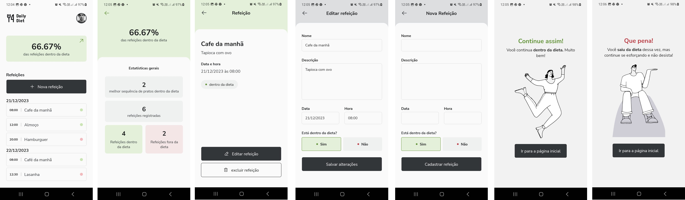

#  

Projeto para resolução de desafio proposto no módulo "Stage-03" do curso de React native da rocketseat.

## Sobre o desafio

O desafio consiste na criação de app para registrar as refeições do usuário.

## Preview 

## Aprendizados

- React native;
- Uso de Styled Component com ReactNative;
- Uso de AsyncStorage;
- FlatList and SectionList;
- TypeScript.

## Stack utilizada

**Front-end:** React Native, Styled-Components, AsyncStorage, TypeScript

